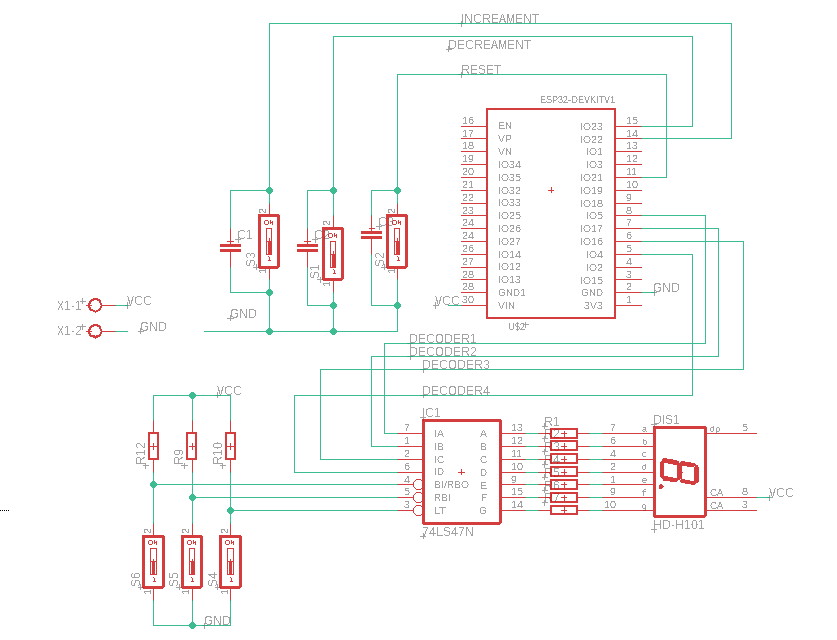

# ESP32 Simple Counter with Micropython
An exploration and entry point project to Micropython.

  

-----
## Table of Content
- [Problem Statement.](#Problem-Statement)
- [Getting Started.](#Getting-Started)
- [Software Architecture.](#Software-Architecture).
- [Hardware Layout.](#Hardware-Layout)
- [Mobile Application](#Mobile-Application)
- [Tutorials and Videos.](#Tutorials-and-Videos)

-----
## Problem Statement
You are to use an __ESP32__ module and program it using __Micropython__ in order to build a simple one-digit counter. The user should be able to control the counter through two different methods concurrently:
- Direct Control (Push Buttons).
- Wireless Control (Mobile Application).

For the __direct control__ method, there should be three push buttons to control the counter. The three buttons should do increment, decrement and reset operations. Also, there should be a __seven segment display__ to display the current counter value.

For the __wireless Control__, the esp32 should broadcast its own __wifi__ network (_being in the "Access Point" operation mode_). Then, the user should be able use his phone to join this WIFI network (access point) and use an __application__ (on his phone) to control the counter and display the current value of the counter. Through the application, the user can do increment, decrement and reset operations.

__Note:__ the current value of the counter has to be same (synchronized) on both the seven segment display and the mobile application at all time. This implies that, if the counter value is changed through push buttons, the value on the application should be automatically updated. Similarly, if the counter value is changed through the application, it should be updated on the seven segment display automatically.

------
## Getting Started
Depending on your background and previous knowledge, what you need to get started may vary. However, I assume you are like me; diving into __Micropython__ for the first time, but having strong basic knowledge in __Embedded Systems__.

In all, I found the [Micropython Documentation](http://docs.micropython.org/en/latest/) extremely helpful in all aspects. A great starting off point was the [Quick Reference For The ESP32](http://docs.micropython.org/en/latest/esp32/quickref.html#quick-reference-for-the-esp32).

 - To get the __firmware__ on my ESP32, I easily followed up this [simple tutorial](http://docs.micropython.org/en/latest/esp32/tutorial/intro.html#getting-the-firmware).
 - I used [Tera Term](https://osdn.net/projects/ttssh2/) as the serial terminal to communicate with the ESP32.
 - Writing the code, I found those documentation pages so helpful:
    - To deal with pins for input and output, [Here](https://docs.micropython.org/en/latest/library/machine.Pin.html).
    - To control the WIFI module and configure the network, [Here](https://docs.micropython.org/en/latest/library/network.WLAN.html).
    - Sockets are needed for communication in the Wireless Control , [Here](https://docs.micropython.org/en/latest/library/usocket.html).
    - Wireless control depends on the existence of a web server. [this tutorial](https://randomnerdtutorials.com/esp32-esp8266-micropython-web-server/) is nice :heart:.

-----
## Software Architecture
After finding comfort in using micropython and communicating with the ESP32 through the serial terminal program, comes the time of thinking about the appropriate software architecture.

To approach the problem, I tried to create a script for each control method separately. So, I build:
- the [local_control.py](https://github.com/AlphaArslan/ESP32-Simple-Counter/blob/master/src/local_control.py) script to implement the __direct control__ method using push buttons and seven segment display. In that script, I tried to achieve the objective using only __interrupts__ attached to the push buttons.
- the [wifi_control.py](https://github.com/AlphaArslan/ESP32-Simple-Counter/blob/master/src/wifi_control.py) script to implement the __wireless control__ method. Here, I used the __super-loop__ architecture to wait for and handle the requests coming from the __mobile application__.

For the two scripts being built on __interrupts__ and __super-loop__, merging them to create [main.py](https://github.com/AlphaArslan/ESP32-Simple-Counter/blob/master/src/main.py) was a trouble-free process. Now, __main.py__ can handle both control methods smoothly. The final architecture is a super-loop cut by interrupts. The super-loop is serving coming requests and the interrupts are serving button presses.

  

-----
## Hardware Layout
Connecting push buttons to the ESP32 is a straight forward process. However, there can be an argument about connecting the seven segment display. One can suggest connecting the display directly to the ESP32. On the other hand, I saw that using a decoder in between the ESP32 and the display was far better in terms of safety and the number of ESP32 pins needed to control the display.

We used the __74LS47N__ BCD to seven segment decoder. We used common anode display.

This schematic was done by my teammate [Seif](https://github.com/princesiefshama)

  

__NOTE:__ the ESP32 is powered through the USB. The rest of the circuitry (decoder and display) are powered by external 5V power supply.

-----
## Mobile Application
The application was done by my teammate [Sief](https://github.com/princesiefshama). More info should be found on [his repository]().

-----
## Tutorials and Videos
As always, tutorials can be found on my [YouTube Channel](https://www.youtube.com/c/alphabitss) as well as my [Facebook Page](https://www.facebook.com/AlphaBITss).
